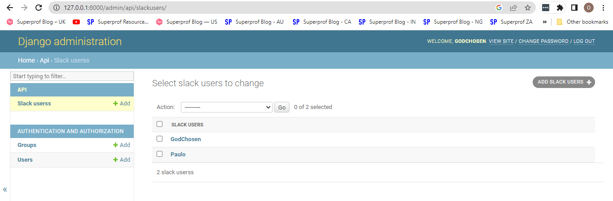
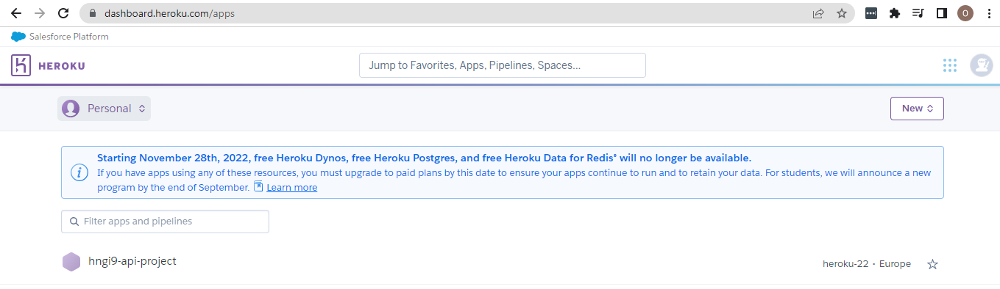

# CREATE AND HOST A GET API ENDPOINT USING PYTHON, DJANGO, AND HEROKU

To ensure a successful completion of this project, here are some prerequisites:
- Have VS Code and some of it's extensions installed.
- Install python (v3.8, v3.9, or 3.10) and virtualenv 
- Create a GitHub account and create a personal access token (PAT)
- Create OpenSSH key pair in your local system and use the public key to create SSH key in GitHub

Below are the steps I followed to implement a MERN STACK for a Todo application that uses a RESTful API.

### 1. Build the Django API Endpoint
I followed the steps below to create the Django Api Endpoint

- Create a Django Project
To create a django project, we first create a directory and virtual environment, install django and other tools needed.
```
# create a directory to house the project
mkdir hngi9-project1

# create a virtual environment
python -m venv .venv && source .venv/Scripts/activate

# install django and djangorestframework
pip install django djangorestframework

# create the requirements.txt file
pip freeze > requirements.txt 

# create a django project in the root directoory
django-admin startproject apiproject .

# create a django app "api" in the root project directory
django-admin startapp api

# sync the database 
python manage.py migrate
```

- Create a superuser to login and manage the database
```
python manage.py createsuperuser --email admin@example.com --username admin
```

- Confirm the superuser can access the database
```
# start the server
python manage.py runserver
```

***To test if the superuser can login and manage the database, open a web browser and enter the address: `http://localhost:8000/admin` or `http://127.0.0.1:8000/admin`. Then use the username and password of the superuser to login.***

- Create a model called "SlackUsers"
To create a model, modify the models.py file in the django app folder "api" as follows:
```
# change to the 'api' directory and open the models.py file
cd api && vi models.py

# copy and paste the code below to the models.py file. Then savee and close the file.
from django.db import models

class SlackUsers(models.Model):
    slackUsername = models.CharField(max_length= 15)
    backend = models.BooleanField()
    age = models.IntegerField()
    bio = models.CharField(max_length= 600)
    
    def __str__(self):
        return self.slackUsername
```

- Modify the admin.py file in the app folder
```
# open the file and add the below code to it
from .models import SlackUsers

admin.site.register(SlackUsers)
```

- Modify the installed_apps section of the settings.py file in the django project folder "apiproject" to look like below
```
INSTALLED_APPS = [
    'django.contrib.admin',
    'django.contrib.auth',
    'django.contrib.contenttypes',
    'django.contrib.sessions',
    'django.contrib.messages',
    'django.contrib.staticfiles',
    
    # My Created Apps
    'api',
]
```

- Sync the changes to the database
```
# Save the changes
python manage.py makemigrations

# sync the changes to the database
python manage.py migrate
```

- Confirm that the models were created and visible in the UI by starting the server using `python manange.py runserver`. Then visit the address: `http://127.0.0.1:8000/admin`.

- Add a test user to the database SlackUser model (table).
There are two ways to achieve that: via code in the terminal or in the admin UI. To add user via code in the terminal, I used the command below:
```
# activate shell for command 
python manage.py shell

# import the model as the terminal is not part of the app
from  api.models import SlackUsers

# add a role to the SlackUsers model (table)
slackuser = SlackUsers(slackUsername="GodChosen", backend=1, age=35, bio="A focused and goal-getting Junior Backend/DevOps Engineer")
```

***Screenshot***
<br />


## 2. Build the API Endpoint
To build the API endpoint, we would use the Django REST Framework and Serializer that help to convert SQL to JSON. Earlier, we installed `djangorestframework`. Now, we would proceed to define the the serializer.

- Create a module `serializers.py` in the app folder 'api'
```
# change to the 'api' directory and create the file 'serializers.py'
cd api && touch serializers.py

# copy and paste the code below into the file and save it
from api.models import SlackUser
from rest_framework import serializers

class SlackUserSerializer(serializers.HyperlinkedModelSerializer):
    class Meta:
        model = SlackUser
        fields = ["url", "slackUsername", "backend", "age", "bio"]
```

***Note that we're using hyperlinked relations in this case with HyperlinkedModelSerializer. You can also use primary key and various other relationships, but hyperlinking is good RESTful design.***

- Modify the module `views.py` in the app folder 'api'
We will define our viewsets in order to send our data from our backend to the browser
```
# copy and paste the code below into the file and save it
from rest_framework import status
from rest_framework.decorators import api_view
from rest_framework.response import Response
from api.models import SlackUser
from api.serializers import SlackUserSerializer


@api_view(['GET'])
def slackUser_list(request, format=None):
    
    slackUser = SlackUser.objects.all()
    serializer = SlackUserSerializer(slackUser, many=True)
    return Response(serializer.data[0]) # return just the first slack user
```

***Django Rest Framework gives us these viewsets for standard CRUD operations on a SQL database. The viewsets accept and handle GET, POST, PUT and DELETE requests, as well as allow for a single endpoint to handle requests for list views of objects in the database and for individual object instances***

- Create a `urls.py` file in the app folder 'api' and paste the code below into it
```
from django.urls import path
from rest_framework.urlpatterns import format_suffix_patterns
from api import views

urlpatterns = [
    path('', views.slackUser_list)
]

urlpatterns = format_suffix_patterns(urlpatterns)
```

- Modify the file `urls.py` in the project folder 'apiproject' to look like below
```
from django.contrib import admin
from django.urls import include, path
# Setup automatic URL routing
# Additionally, we include login URLs for the browsable API.
urlpatterns = [
    path('admin/', admin.site.urls),
    path('', include('api.urls'))
]
```

- Still modifying the file `settings.py` in the project folder 'apiproject', add the code to the installed apps section.
```
INSTALLED_APPS = [
    ...
    'rest_framework',
]
```

***Postman API Test***
<br />


***Browser API Test***
<br />


## 3. Deploy to HEROKU
Below are the steps to deploy to Heroku:

- Create an app on Heroku and connect it to the GitHub repository for this project

***App Created on Heroku***
<br />


- Create an environment file `.env` in the root folder and paste the code below.
```
export SECRET_KEY="key-in-the-settings.py file"
```

- Modify the settings.py file as follows
```
# add the `import os` code and change the SECRET_KEY line to the below line
import os
SECRET_KEY = os.environ.get(SECRET_KEY)

# change the security warning session to the below code
DEBUG = False
ALLOWED_HOSTS = ["*"]
```

- Install whitenoise and configure django to use to serve static site
```
# install whitenoise
pip install whitenoise

# add whitenoise middleware to the middleware section of the `setting.py` file
'whitenoise.middleware.WhiteNoiseMiddleware',
```

- Configure django for heroku
```
# install `django_on_heroku`
pip install django_on_heroku

# import `django_heroku` in the `settings.py`
import django_on_heroku

# add the following code to the `setting.py` file
django_on_heroku.settings(locals())
```

- Configure `gunicorn` to help serve our app online
```
# install gunicorn
pip install gunicorn

# create the `Procfile` and paste the below lines in it
web: gunicorn api.wsgi
release: python manage.py makemigrations --noinput
release: python manage.py collectstatic --noinput
release: python manage.py migrate --noinput

# install psycopg2 module, as heroku needs it for the proper functioning of postgres database it provisions for our app
pip install psycopg2-binary

# create and populate the `Pipfile` which Heroku uses to install dependencies
pipenv shell
```

- Add the SECRET_KEY as variable to your Heroku app.

- Push changes to GitHub abd Deploy changes on Heroku.


***API working on Heroku***
<br />

